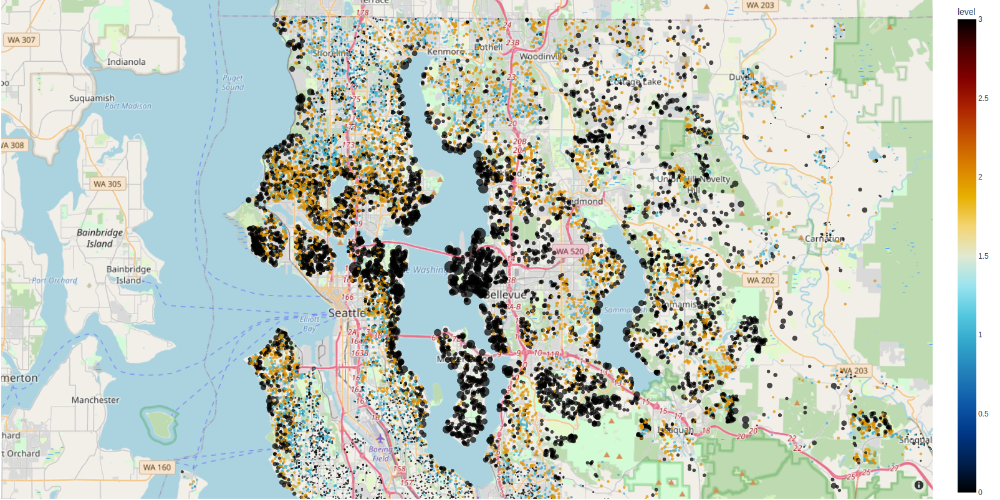
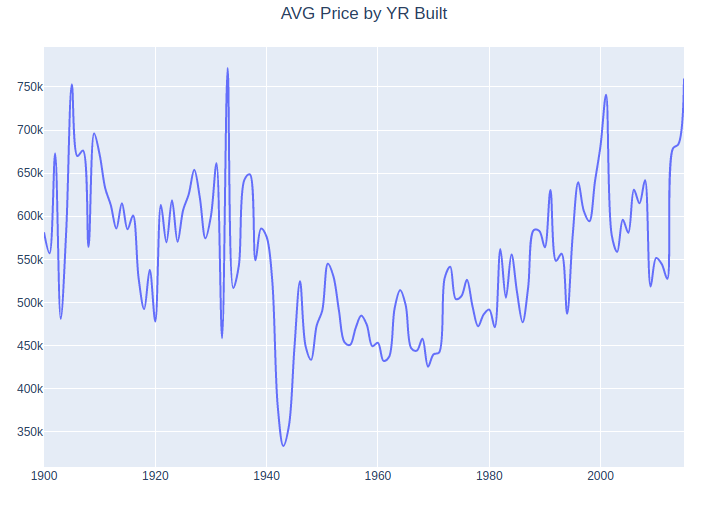
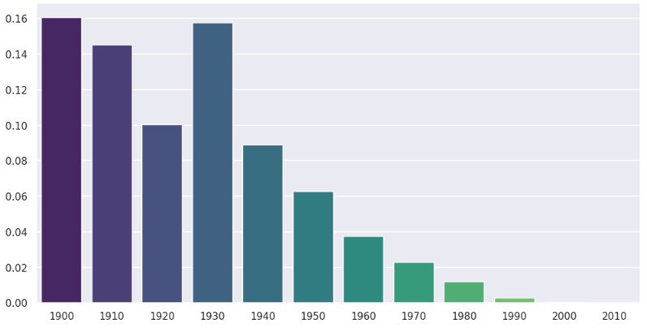

# House Rocket
> Increasing a real estate company's profit through data analysis.

## **1. Abstract**
House Rocket is a real estate buying and selling company primarily operating in King County, Washington State, USA. It is a fictitious company and used here to illustrate the **insights generation process** through analyzing and manipulating data to assist in **business decision making**.

House Rocket's strategic area wants to find the best opportunities for buying and selling real estate to maximize the company's profits. The business team cannot make good decisions without analyzing the data and the portfolio is very large and it would take a long time to perform this analysis manually.

The solution was presented through a Dashboard containing the information requested by the business team. It can be accessed by clicking [here](https://igorvgp-data-analysis-hou-appv03-streamlit-app-dashboard-w7yl50.streamlit.app/).

A data analysis answering the main business questions was also developed. The notebook can be accessed by clicking [here](https://nbviewer.org/github/igorvgp/data_analysis_house_rocket/blob/main/notebooks/data_analysis.ipynb).

### **2. Business Understanding**

### **2.1. Data**

The data was taken from Kaggle and can be seen by clicking [here](https://www.kaggle.com/datasets/harlfoxem/housesalesprediction).

| Feature                | Definition                                                                                               |
|------------------------|----------------------------------------------------------------------------------------------------------|
| id                     | Unique ID for each home                                                                                  |
| date                   | Date of the home sale                                                                                    |
| price                  | Price of each home                                                                                       |
| bedrooms               | Number of bedrooms                                                                                       |
| bathrooms              | Number of bathrooms, where .5 accounts for a room with a toilet but no shower                            |
| sqft_living            | Square footage of the apartment interior living space                                                    |
| sqft_lot               | Square footage of the land space                                                                         |
| floors                 | Number of floors                                                                                         |
| waterfront             | A dummy variable for whether the apartment was overlooking the waterfront or not                         |
| view                   | An index from 0 to 4 of how good the view of the property was                                            |
| condition              | An index from 1 to 5 on the condition of the apartment                                                   |
| grade                  | An index from 1 to 13, where 1-3 falls short of building construction and design, 7 has an average level of construction and design, and 11-13 have a high-quality level of construction and design. |
| sqft_above             | The square footage of the interior housing space that is above ground level                              |
| sqft_basement          | The square footage of the interior housing space that is below ground level                              |
| yr_built               | The year the house was initially built                                                                   |
| yr_renovated           | The year of the house’s last renovation                                                                  |
| zipcode                | What zipcode area the house is in                                                                        |
| lat                    | Lattitude                                                                                                |
| long                   | Longitude                                                                                                |
| sqft_living15          | The square footage of interior housing living space for the nearest 15 neighbors                         |
| sqft_lot15             | The square footage of the land lots of the nearest 15 neighbors                                          |

### **2.2. Business assumption**
 
* There may be typing errors in some records that must be dealt with/removed during data cleaning.

* The `date` variable refers to the date the property was made available for sale.

* Properties where the `yr_renovated` variable is equal to 0, are considered to have not undergone renovations.

## **3. Solution Plan**

To solve business problems, we explore the data, create hypotheses, validate them and learn from them, we use them in building the solution, which were delivered according to the need.

### **3.1. Tools & Techniques**

To solve the problems presented, the following was used:

* Python, Pandas, Matplotlib, Plotly, Seaborn and Geopandas.
* Jupyter Notebook and VSCode.
* Streamlit e Streamlit Cloud.
* Git and Github.
* Descriptive statistics techniques.
* Exploratory Data Analysis techniques (EDA). 

### **3.2. Deliverables**

For this problem, the following solutions were delivered:

* [Map with all properties and its details](https://htmlpreview.github.io/?https://github.com/igorvgp/data_analysis_house_rocket/blob/main/results/kc_house_map.html).

* [Online Dashboard](https://igorvgp-data-analysis-hou-appv03-streamlit-app-dashboard-w7yl50.streamlit.app/).

## **4. Exploratory Data Analysis (EDA)**

### **4.1. Main Insights**

The main insights found were:

**1. Properties with waterview are more expensive.**
On the map, you can see that most of the properties owith waterview are labeled with black dots, it means that they are more expensive.

**2. Properties built in the 1930s have a higher proportion of renovations.**
In the plot below we can see that Properties built between 1940 and 1980 are cheaper.

**3. Properties built between 1940 and 1980 are 15% cheaper.**
About 16% of the properties built at that time were renovated at some point.
**Renovation rate over the dacades**

## **4. Resultados (ROI - Return on Investment)**

Caso todos os imóveis que foram comprados, assim como sugerido, sejam vendidos posteriormente, a House Rocket terá um lucro estimado de **$ 51 milhões**

## **5. Conclusão**

A análise dos dados trouxeram informações valiosas para que a área responsável possa tomar a decisão de qual imóvel comprar e qual venda.

Mais do que apenas indicar os imóveis, conseguimos modelar uma lógica de precificação baseado na densidade de anúncios por região e pela sazonalidade para a venda

## **6. Próximos Passos**

Como próximos passos, sugerimos:

* Aprofundar a lógica de precificação adicionando mais registros (inclusive de outros peíodos que não apenas 2014 e 2015)
* Treinar modleos de ML para estimar valores de compra e venda com base em certas características
